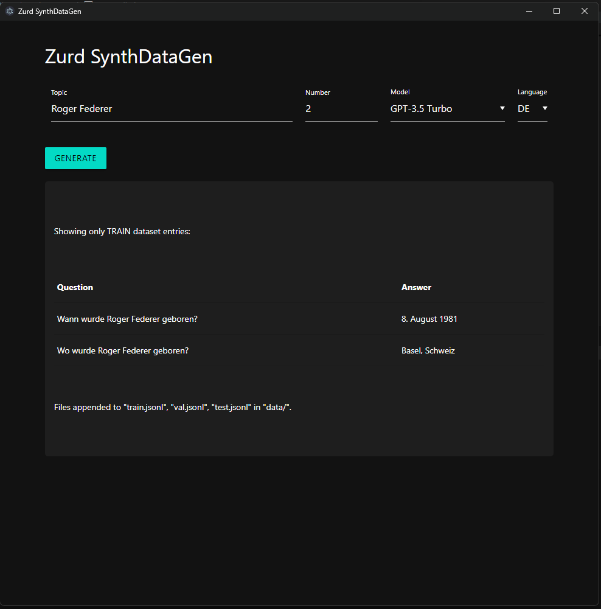

# Zurd SynthDataGen

This Electron project uses the OpenAI ChatCompletion API to generate synthetic datasets in either German (DE) or English (EN). Each request is automatically split into three JSONL files (`train.jsonl`, `val.jsonl`, `test.jsonl`), and new data is always **appended**. In the user interface, however, only the **train** dataset is displayed in a table.

## Features

- **Electron app** (GUI) with Materialize CSS in dark mode
- **Language selection** (DE/EN)
- **Model selection** (e.g., `gpt-4`, `gpt-4o`, etc.)
- **Continuous appending** to `train.jsonl`, `val.jsonl`, and `test.jsonl` (no overwriting)
- **UI table** only shows entries from `train.jsonl` (train split)



## Requirements

1. **Node.js** (version 14 or higher)
2. **OpenAI API Key** (in a `.env` file or set as an environment variable)

## Installation & Setup

1. **Clone the repository**:
   ```bash
   git clone https://github.com/zurd46/ZurdSynthDataGen.git
   cd ZurdSynthDataGen
   ```
2. **Install dependencies:**:
   ```bash
   npm install
   ```
3. **Set up your OpenAI API key**:
   Create a file named .env in the project root and add:
   ```bash
   OPENAI_API_KEY=sk-xxxxxxxxxxxxxxxxxxxxxx
   ```
4. **Start the app:**
   This will open an Electron window with the Zurd SynthDataGen interface.
   ```bash
   npm start
   ```
